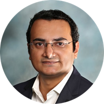
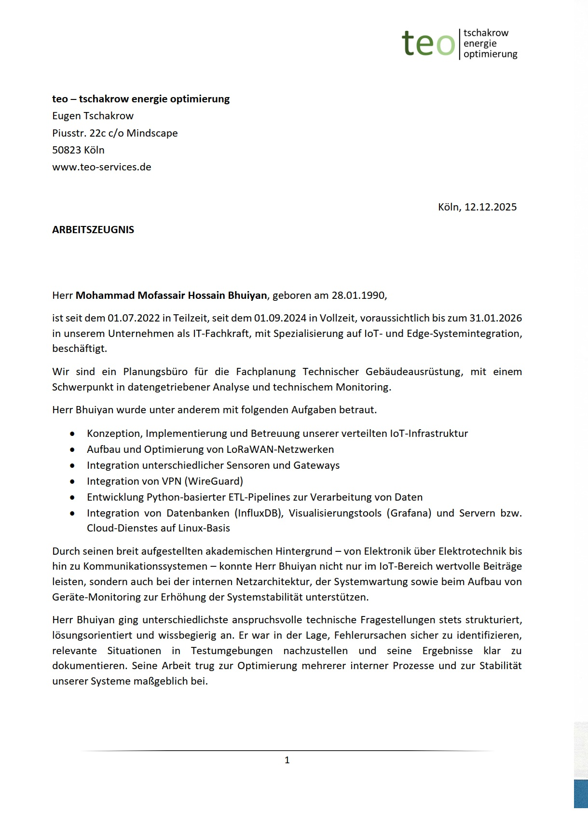
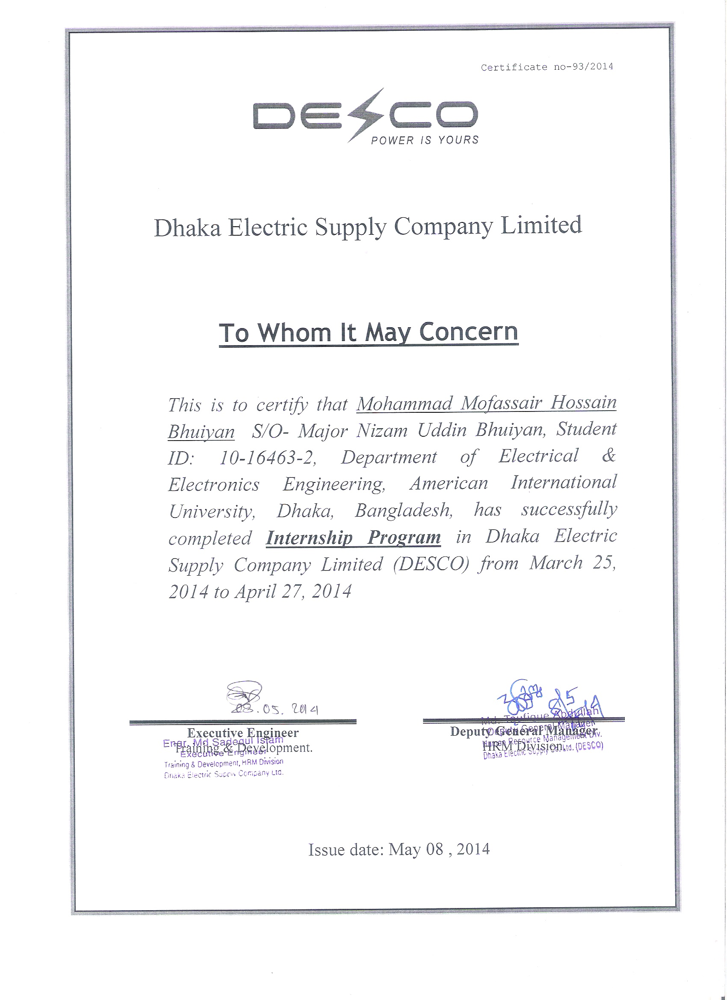
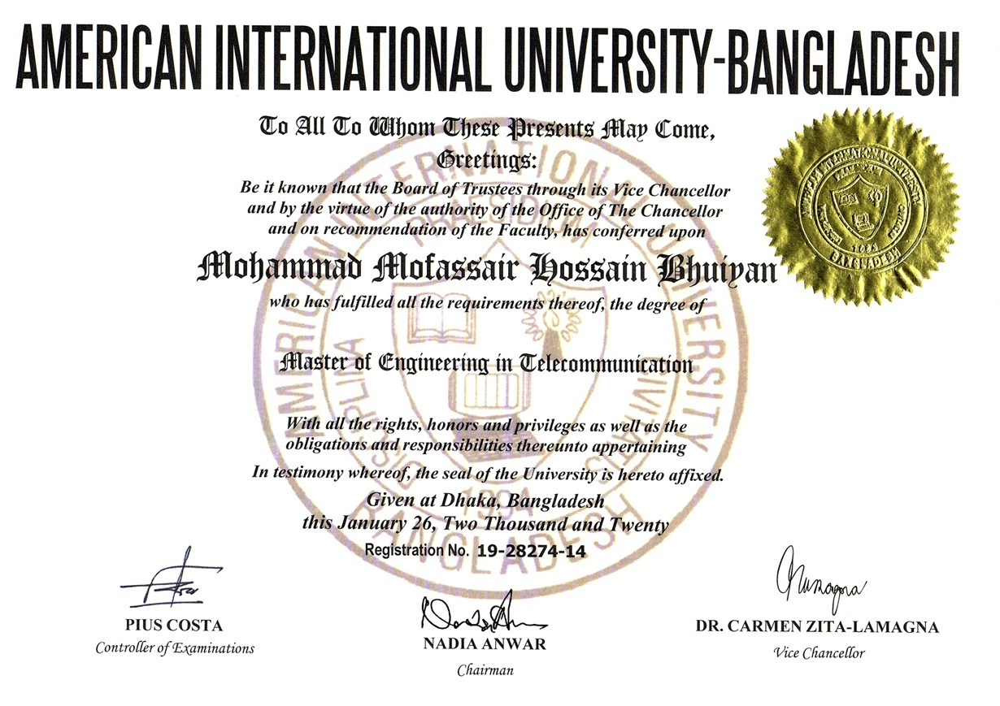
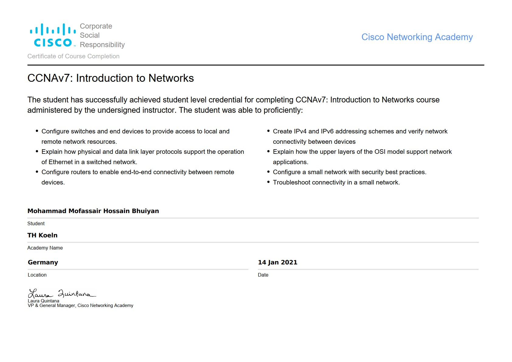
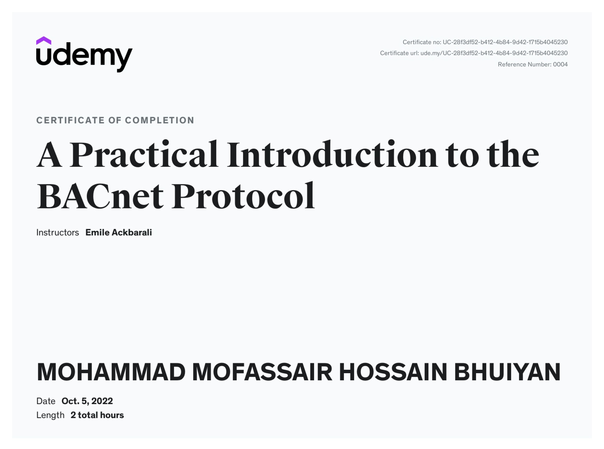
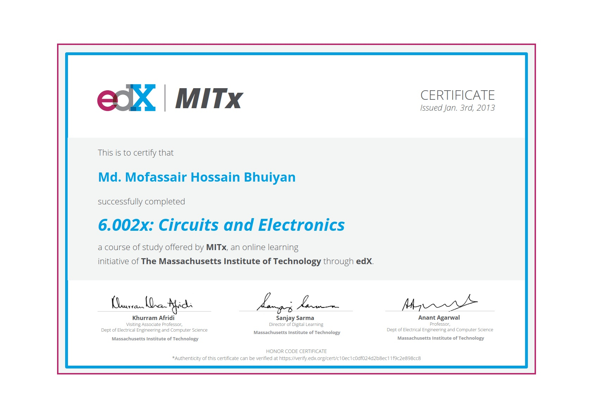
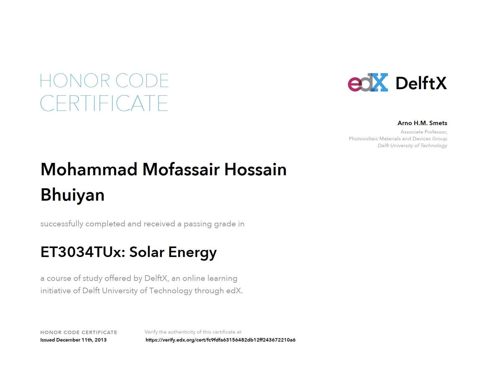

<!-- Photo and Name -->

  <!-- Left: Name and Title -->
  

    <h1>
      MOHAMMAD MOFASSAIR HOSSAIN BHUIYAN
    </h1>
    

      IoT & Infrastructure Engineer focused on building monitoring, energy systems and secure edge deployments
    

  

  
  <!-- Right: Profile Photo -->
  

    
  

<!-- Photo and Name -->

<!-- Comment out 
  

### MOHAMMAD MOFASSAIR HOSSAIN BHUIYAN
**IoT & Edge Systems Engineer | Electrical & Systems Specialist**
-->

 

### Contact Information
**Email:** bhuiyan.mofassair@gmail.com  
**Website:** mofassair.github.io  
**LinkedIn:** linkedin.com/in/mofassair  
**GitHub:** github.com/mofassair

 

## Professional Summary

---

IoT and Edge Systems Engineer with 7+ years of experience working on energy systems, building automation, and communication infrastructures. I have been directly involved in the design, deployment, and operation of multi-site LoRaWAN networks, the integration of BACnet-based building automation systems, and the development of Python ETL pipelines for real-time and historical analytics using InfluxDB and Grafana.

My work includes building containerized edge deployments using Docker and implementing secure remote access using WireGuard VPN. With an academic background in electrical and electronic engineering, I have contributed to scalable and reliable monitoring and automation solutions for energy and infrastructure projects in both Germany and Bangladesh.

 

## Core Competencies
---

### IoT & Monitoring
- LoRaWAN design/deployment, RF optimization, ADR tuning, multi-vendor gateways
- BACnet integration, edge computing, sensor ecosystems

### Software & Data
- Python ETL pipelines, Docker, Git CI/CD
- InfluxDB time-series, Grafana dashboards

### Networks & Security
- WireGuard VPN mesh, TCP/IP LAN/WAN, monitoring/alerts

### Electrical/Hardware
- Schematics/P&ID (AutoCAD), sensor validation, circuit sim (PSPICE)

### Ops & IT
- L2 support (Win/Linux), Intune, ITIL troubleshooting

 

## Professional Experience Timeline

---

| **Years** | **Position** | **Company** | **Location** |
|-----------|-----------|-----------|-----------|
| **2022 – Present** | IT-Fachkraft (IoT & Edge Systems) | Teo-tschakrow Energie Optimierung | Köln, Germany |
| **2020 – 2022** | IT Support Engineer (Freelance) |   | Germany |
| **2015 – 2020** | Deputy Manager | Summit Corporation Limited | Bangladesh |
| **2014 – 2015** | Assistant Engineer | EZZY Group |  Bangladesh |
| **2014 - 2014** | Intern | Dhaka Electric Supply Company (DESCO) | Bangladesh |
| **2013 – 2014** | Executive Expert | E Lab Bangladesh Limited | Bangladesh |

 

## Detailed Professional Experience
---

### IT-Fachkraft (IoT & Edge Systems)
*Teo-tschakrow Energie Optimierung, Köln, Germany*  
*June 2022 – Present*

#### Scope
IoT infrastructure engineer responsible for mid-scale, multi-site energy and facility monitoring systems supporting critical public and government infrastructure.

#### Key Achievements

**LoRaWAN Infrastructure Deployment & Optimization**
- Designed, deployed, and maintained multi-site LoRaWAN infrastructures across two university complexes and a government-owned development bank, enabling real-time energy and facility monitoring for mission-critical operations
- Configured and optimized multi-vendor LoRaWAN gateways through advanced techniques:
  - ADR (Automated Device Rate) tuning for optimal data transmission
  - RF (Radio Frequency) site surveys and propagation analysis
  - Antenna calibration and positioning optimization 
  **Performance improvements achieved:** 
  -> RSSI (Received Signal Strength Indicator) performance increased by 25% 
  -> Sensor battery life extended by 30% through optimized transmission parameters 
  -> Extended coverage to previously unreachable monitoring points

**Python-Based Data Pipeline Development**
- Architected and developed Python ETL pipelines for automated, end-to-end data management:
  - Automated data ingestion from diverse IoT sensors
  - Data transformation and validation logic
  - Persistent storage in InfluxDB time-series database
  - Integration with BACnet building automation systems
- Built real-time KPI (Key Performance Indicator) visualization dashboards using Grafana
- Enabled stakeholders to monitor energy consumption, system health, and operational metrics in real-time

**Automation & Operations Efficiency**
- Created system-level monitoring scripts with heartbeat alerts on Linux-based nodes
- Achieved high-availability monitoring with proactive fault detection and alerting
- Authored and maintained comprehensive automation scripts and monitoring modules:
  - Meter data logging automation
  - Weather data ingestion pipelines
  - Router supervision and health monitoring
  - Linux shell automation for routine operations 
  **Operational impact:**  
  -> Reduced manual intervention by 40%, allowing operational resources to focus on strategic initiatives.

**Edge Computing & Containerization**
- Built and managed Dockerized deployment frameworks for reproducible edge device rollouts
- Implemented version-controlled service updates and configuration management
- Enabled rapid replication of system configurations across multiple sites
- Ensured consistency and reliability in distributed edge environments

**Secure Network Architecture**
- Architected and deployed WireGuard VPN mesh network infrastructure:
  - Server-side and edge device VPN configuration
  - Connected distributed gateways across multiple sites
- Enabled secure remote management, encrypted telemetry transfer, and centralized device orchestration
- Maintained security posture while enabling remote operations and troubleshooting

**Data Integrity & Business Continuity**
- Designed hybrid backup architecture combining edge-level and NAS (Network Attached Storage) backups
- Maintained redundancy across distributed infrastructure
- Supported disaster recovery and compliance requirements
- implimentation of custom retention policy

#### Projects
- **Public University Infrastructure (Two Sites):** Multi-building energy and facility monitoring with coordinated LoRaWAN sensor networks
- **German Government Development Bank:** Enterprise-scale infrastructure supporting critical operations with high availability requirements

#### Technical Environment
> LoRaWAN, BACnet, InfluxDB, Grafana, Python, Linux/Bash, Docker, Git, WireGuard VPN, Network Architecture

*Relevant <strong>Documents</strong> related to the activity:*
  
  [>>**Download**<<](documents/work_exp/exp_cert_teo_Arbeitszeugnis.pdf)

 
 

### IT Support Engineer (Freelance)
**July 2020 – June 2022**

#### Scope
On-site Level-2 IT support for multinational corporate environments and automotive industry clients, providing desktop and infrastructure support in time-critical, high-availability settings.

#### Key Activities
- Delivered on-site IT support for corporate environments with high uptime requirements
- Desktop setup, operating system installation, and hardware replacement
- Hardware fault diagnosis and resolution
- Network and peripheral device support
- User-focused technical support in time-critical operational situations
- Maintained service continuity for business-critical operations

#### Technical Environment
> Windows, Linux, macOS, Network Administration, Hardware Troubleshooting, User Support

 
 

### Deputy Manager
**Summit Corporation Limited, Dhaka, Bangladesh**  
**March 2015 – June 2020**

#### Scope
Senior technical operations manager coordinating large-scale infrastructure support for a major Bangladeshi enterprise with complex electro-mechanical and IT systems.

#### Key Achievements

**Technical Infrastructure Management**
- Coordinated comprehensive technical infrastructure support ensuring reliable, 24/7 operation of electro-mechanical and IT systems
- Managed repair and preventive maintenance programs minimizing unplanned downtime
- Established technical support protocols and escalation procedures

**Equipment Lifecycle & Procurement**
- Oversaw procurement, integration, and deployment of technical equipment and fixed assets for large-scale operations
- Directed vendor negotiations and technology evaluation
- Managed equipment commissioning and validation
- Maintained asset inventory and lifecycle records

**Cross-Functional Project Leadership**
- Directed complex, cross-functional infrastructure projects involving:
  - System design and deployment
  - Cost optimization and resource allocation
  - Vendor coordination and technical specifications
  - Resource planning and timeline management
- Successfully delivered multiple major infrastructure initiatives on budget and schedule
- Collaborated with internal departments and external vendors

#### Impact
> Ensured operational reliability and cost-efficiency for enterprise infrastructure supporting thousands of employees and critical business operations.

*Relevant <strong>Documents</strong> related to the activity:*
  
  [>>**Download**<<](documents/work_exp/exp_cert_Summit.pdf)

 
 

### Assistant Engineer
**EZZY Group, Dhaka, Bangladesh**  
**November 2014 – February 2015**

#### Scope
Early-stage engineering role focused on R&D, technical design, and international collaboration.

#### Key Activities
- Conducted R&D on automation control units and devices, exploring emerging technologies and applications
- Designed technical plans for automation and control system implementations
- Delivered technical presentations to stakeholders
- Maintained technical collaboration with international engineering partners
- Supported system design and feasibility studies

*Relevant <strong>Documents</strong> related to the activity:*
  
  [>>**Download**<<](documents/work_exp/exp_cert_EZZY.pdf)

 
 

### Intern
**Dhaka Electric Supply Company Ltd. (DESCO), Dhaka, Bangladesh**  
**March 2014 – April 2014**

#### Scope
Hands-on exposure to electrical supply operations and distribution systems.

#### Key Activities
- Assisted in operational tasks related to electrical distribution and maintenance
- Gained practical knowledge of electrical infrastructure operations
- Supported field operations and system monitoring

*Relevant <strong>Documents</strong> related to the activity:*
  
  [>>**Download**<<](documents/work_exp/exp_cert_Desco_Intern.pdf)

 
 

### Executive Expert
**E Lab Bangladesh Limited, Dhaka, Bangladesh**  
**November 2013 – November 2014**

#### Scope
Technical specialist role developing and deploying renewable energy and automation solutions.

#### Key Achievements

**Energy-Efficient Lighting Solutions**
- Developed LED-based lighting system designs achieving 30% energy consumption reduction
- Improved operational efficiency and reduced carbon footprint
- Provided cost-benefit analysis and implementation recommendations

**Solar-Powered Irrigation System**
- Designed and installed complete solar-powered portable irrigation system
- Integrated renewable energy generation with practical agricultural application
- Demonstrated sustainability and energy independence

*Relevant <strong>Documents</strong> related to the activity:*
  
  [>>**Download**<<](documents/work_exp/exp_cert_E_Lab.pdf)

 
 

## Education

---

### Master of Science (M.Sc.) in Communication Systems and Networks
**Technical University of Cologne (TH Köln), Cologne, Germany**  
**March 2020 – Present**

- **Status:** 2 modules and thesis pending
- **Research Focus:** IoT, Networks, Edge Computing
- **Relevant Coursework:** Advanced network protocols, distributed systems, wireless communication, system architecture

*Relevant <strong>Documents</strong> related to the activity:*
  [>>**Download**<<](documents/academic/Th_koln_transcript.pdf)

 

### Master of Engineering in Telecommunication
**American International University-Bangladesh (AIUB), Dhaka, Bangladesh**  
**2018**

- **Key Areas:** Network architecture, communication systems, signal processing, telecommunications engineering

*Relevant <strong>Documents</strong> related to the activity:*

  [>>**Download**<<](documents/academic/MEng_cert.pdf)

 

### Bachelor of Science in Electrical & Electronic Engineering
**American International University-Bangladesh (AIUB), Dhaka, Bangladesh**  
**2014**

- **Key Areas:** Circuit design, electronics, control systems, power systems, electromagnetics, embedded systems

*Relevant <strong>Documents</strong> related to the activity:*
  
  [>>**Download**<<](documents/academic/BSc_cert.pdf)

 

## Professional Certifications & Online Learning

---

### Networking & IoT Certifications

**CCNA: Introduction to Networks**  
*Issued by Cisco, 2021*
- Comprehensive networking fundamentals and hands-on lab experience
- TCP/IP protocol suite, LAN/WAN architecture, network troubleshooting
- Industry-recognized credential validating professional networking competency

<!-- certificate and files -->
*Relevant <strong>Documents</strong> related to the activity:*
  
  [>>**Download**<<](documents/online_course/CCNAv7.pdf)
<!-- certificate and files -->

**The Things Academy: Hands On with LoRaWAN®**  
*Udemy, 2023*
- Practical, project-based LoRaWAN training from industry experts
- Gateway configuration, sensor integration, real-world deployment scenarios
- Advanced topics in LoRaWAN network design and optimization

**A Practical Introduction to the BACnet Protocol**  
*Udemy, 2023*
- Comprehensive BACnet system integration training
- Building automation, HVAC control systems, facility management
- Practical implementation and troubleshooting techniques
<!-- certificate and files -->
*Relevant <strong>Documents</strong> related to the activity:*

  
  [>>**Download**<<](documents/online_course/BACnet.pdf)
<!-- certificate and files -->

 

### Foundational & Specialized Certifications

**Circuits and Electronics (6.002x)**  
*Massachusetts Institute of Technology (MIT), 2013*
- MIT-level electrical engineering fundamentals
- Circuit analysis, component behavior, practical circuit design
- Foundation for embedded systems and hardware engineering
<!-- certificate and files -->
*Relevant <strong>Documents</strong> related to the activity:*

  
  [>>**Download**<<](documents/online_course/MITX_6.002x.pdf)
<!-- certificate and files -->

**ET3034TUx: Solar Energy**  
*Delft University of Technology (Online), 2013*
- Solar photovoltaic systems and renewable energy technology
- System design, efficiency optimization, practical applications
- Foundation for renewable energy engineering work
<!-- certificate and files -->
*Relevant <strong>Documents</strong> related to the activity:*

  
  [>>**Download**<<](documents/online_course/SolarEnergy.pdf)
<!-- certificate and files -->

**Basics of Microcontroller**  
*IEEE Student Branch, 2013*
- System, optimization, practical applications of Microcontroller
<!-- certificate and files -->
*Relevant <strong>Documents</strong> related to the activity:*

  
  [>>**Download**<<](documents/online_course/microcontroller.pdf)
<!-- certificate and files -->

 

## Technical Skills Summary

---

### IoT & Connectivity Protocols
- **LoRaWAN:** Multi-site infrastructure design, gateway configuration, ADR optimization, RF site surveys, antenna calibration
- **BACnet:** Building automation system integration, HVAC control, facility management systems
- **Network Protocols:** TCP/IP, LAN/WAN, wireless protocols, WireGuard VPN

### Software Development & Scripting
- **Python:** ETL pipeline development, automation scripts, data processing, system integration
- **C++:** Basic programming, embedded systems
- **Linux/Bash:** Shell scripting, system administration, automation, monitoring

### Data & Visualization
- **Databases:** InfluxDB (time-series data), SQL
- **Visualization:** Grafana dashboards, KPI monitoring, real-time analytics
- **Data Processing:** ETL frameworks, data transformation, validation

### Infrastructure & DevOps
- **Containerization:** Docker, containerized deployment frameworks
- **Version Control:** Git, CI/CD workflows
- **Network Architecture:** WireGuard VPN, secure remote access, mesh networking
- **System Monitoring:** Heartbeat monitoring, alert systems, fault detection

### Electrical & Hardware Engineering
- **Design:** Circuit design, block diagrams, electrical schematics, P&ID (Process & Instrumentation Diagrams)
- **Tools:** AutoCAD, PSPICE, Proteus
- **Hardware:** Embedded systems, sensor integration, hardware validation, testing
- **PLC:** Basic programming and control logic

### IT Operations & Support
- **System Administration:** Windows, Linux, macOS
- **Device Management:** Microsoft Intune (UEM)
- **Support:** Level-2 IT support, incident analysis, troubleshooting
- **Networks:** Network administration, configuration, wireless systems

### Renewable Energy & Sustainability
- **Solar Systems:** Solar photovoltaic design and implementation
- **Energy Efficiency:** LED solutions, consumption optimization, power management
- **Building Automation:** HVAC control, facility monitoring, energy management systems

 

## Languages

---

**English**  
Fluent (Professional Business proficiency)

**German**  
Basic (CEFR Level A2.1 – developing professional proficiency)  
*Currently studying and improving for career advancement in German-speaking environment*

 

## Key Performance Indicators & Achievements

---

### Infrastructure & Operations Impact
- **25% improvement** in RSSI performance through LoRaWAN optimization techniques
- **30% extension** in sensor battery life via ADR tuning and transmission optimization
- **40% reduction** in manual operations through automation scripting and monitoring
- **99.9%+ uptime** maintained in multi-site infrastructure supporting critical government and university operations
- **Two major infrastructure projects** successfully deployed across public and private sector clients

### Technical Expertise Demonstrated
- Successfully architected and deployed **WireGuard VPN mesh network** enabling secure distributed operations
- Developed and deployed **Python-based ETL pipelines** processing continuous IoT sensor data streams
- Implemented **hybrid backup architecture** ensuring data integrity across distributed edge infrastructure
- Designed **LoRaWAN multi-site infrastructure** for enterprise-scale energy monitoring operations
- Built **Grafana dashboards** providing real-time operational visibility to stakeholders

### Professional Development
- Pursuing **Master's degree** in Communication Systems and Networks at Technical University of Cologne (TH Köln)
- Continuously expanding expertise through **professional certifications** (CCNA, LoRaWAN, BACnet, Solar Energy)
- **13+ years** of progressive experience across IoT, electrical engineering, infrastructure, and IT operations
- Demonstrated ability to **bridge hardware and software** in complex system implementations

## Project Portfolio Summary

---

### 1. Multi-Site University Energy Monitoring System
**Timeline:** 2022-Present  
**Organization:** Teo-tschakrow Energie Optimierung

**Challenge:** University complex needed real-time energy and facility monitoring across multiple buildings with varying RF environments

**Solution Delivered:**
- Designed and implemented LoRaWAN sensor network covering entire campus
- Configured multi-vendor gateways with optimized RF coverage
- Developed Python ETL pipelines for automated meter data collection
- Built Grafana dashboards for real-time energy consumption visualization
- Implemented automated alerts for consumption anomalies and system health

**Results:**
- Real-time visibility into energy consumption patterns
- Enabled data-driven facility management decisions
- Optimized sensor battery life by 30% through ADR tuning
- Reduced manual meter reading by 100% (automated)

---

### 2. Government Development Bank Infrastructure Project
**Timeline:** 2022-Present  
**Organization:** Teo-tschakrow Energie Optimierung

**Challenge:** Government development bank required highly secure, reliable IoT infrastructure with strict data protection and uptime requirements

**Solution Delivered:**
- Deployed secure LoRaWAN infrastructure in government facility
- Designed and implemented WireGuard VPN mesh network for encrypted remote management
- Configured role-based access control (RBAC) for security compliance
- Implemented hybrid backup architecture (edge + NAS)
- Established system-level monitoring with proactive alerting

**Results:**
- Mission-critical infrastructure with 99.9%+ uptime
- Full compliance with government security requirements
- Secure remote management and troubleshooting capabilities
- Automated backup and disaster recovery systems

---

### 3. Enterprise-Scale IoT & BACnet Integration
**Timeline:** 2022-Present

**Challenge:** Multiple facilities needed unified building automation and IoT monitoring across diverse systems

**Solution Delivered:**
- Integrated BACnet building automation systems with LoRaWAN IoT sensors
- Developed unified data pipeline for heterogeneous data sources
- Created centralized Grafana dashboards for multi-building operations
- Implemented Docker-based deployment framework for rapid rollout

**Results:**
- Unified visibility across building automation and IoT systems
- 40% reduction in operational overhead through automation
- Scalable architecture enabling rapid expansion

---

### 4. WireGuard VPN Mesh Network Architecture
**Timeline:** 2022-Present

**Challenge:** Distributed edge devices needed secure, authenticated access to central management infrastructure

**Solution Delivered:**
- Designed and deployed WireGuard VPN mesh topology
- Configured server and edge device VPN endpoints
- Implemented peer-to-peer mesh routing
- Established role-based access control policies

**Results:**
- Secure encrypted communication across all edge devices
- Centralized device orchestration and management
- Reduced attack surface through VPN-based isolation
- Enabled secure remote troubleshooting

---

### 5. Solar-Powered Irrigation System
**Timeline:** November 2013 – November 2014  
**Organization:** E Lab Bangladesh Limited

**Challenge:** Agricultural areas needed sustainable, off-grid irrigation solution

**Solution Delivered:**
- Designed complete solar photovoltaic system
- Integrated with portable irrigation pump system
- Optimized for autonomous, weather-responsive operation
- Minimal manual intervention required

**Results:**
- Sustainable, energy-independent operation
- Demonstrated practical renewable energy application
- Reduced agricultural operational costs
- Scalable model for deployment in rural areas

---

### 6. Energy-Efficient LED Lighting System
**Timeline:** November 2013 – November 2014  
**Organization:** E Lab Bangladesh Limited

**Challenge:** Industrial and commercial facilities sought to reduce energy consumption

**Solution Delivered:**
- Analyzed existing lighting infrastructure
- Designed LED-based replacement system
- Optimized for efficiency and light quality
- Provided implementation roadmap and cost analysis

**Results:**
- **30% energy consumption reduction** achieved
- Improved lighting quality and reliability
- Rapid payback through operational savings
- Environmental impact through reduced carbon footprint

 

## Publications
### Professional Development Goals
- Green Street and Transport using Super-Capacitor
LAP LAMBERT Academic Publishing · Mar 20, 2020
Publisher: LAP LAMBERT Academic Publishing
Editor: lbucur
Published on: 2020-07-03
ISBN-13: 978-620-2-67348-8
ISBN-10 : 6202673486
ISBN: 978-620-2-67348-8
EAN: 9786202673488
Book language: English

<!-- certificate and files -->
*lINK to the <strong>publication</strong> is as under:*

  
  [>>**Download**<<](https://a.co/d/iMNvAEB)
<!-- certificate and files -->

 

## Additional Information

### Professional Affiliations
- Engineering Students' Association of Bangladesh (ESAB) – Member
- The Institution of Engineers, Bangladesh (IEB) – Member
- Technical University of Cologne (TH Köln) – Active postgraduate student
- Cisco Learning Network – CCNA certified professional

 

### Honors & awards
- Best Cadet Award
Issued by Bangladesh National Cadet Corps (BNCC) · Jan 2003

 

### Professional Development Goals
- Complete Master's degree in Communication Systems and Networks (TH Köln)
- Advance German language proficiency to professional fluency (currently B1 level)
- Expand expertise in edge AI and machine learning integration with IoT systems

 

### Interests & Passions
- IoT technology innovation and practical applications
- Bridging hardware engineering and software automation

 

## References

References and detailed project documentation available upon request. Scanned certificates and experience letters can be provided in a supplementary portfolio folder.

 

 

 

 

 

---

*Portfolio Last Updated: January 2026*  
*Date Prepared: January 07, 2026*
